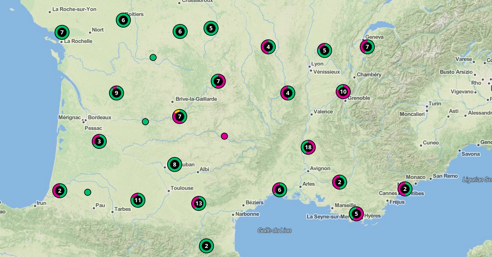

## Cistercian monasteries in France

Interactive map of Cistercian monasteries in France, data taken from [fr.wikipedia.org](https://fr.wikipedia.org/wiki/Liste_d%27abbayes_cisterciennes_de_France).

### Demo

- http://hde.geogr.muni.cz/cisterciansfrance/

##### scrap.js

- scrapping data from the wikipedia table with [cheeriojs](https://github.com/cheeriojs) and generates [csv](https://github.com/koles/ya-csv) and [json](https://www.npmjs.com/package/csvtojson) files

##### ./app

- app built on typescript, [parcel](https://parceljs.org/) and [leaflet](https://leafletjs.com/) that takes scrapped json files and generates map visualisation
